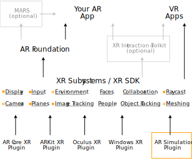
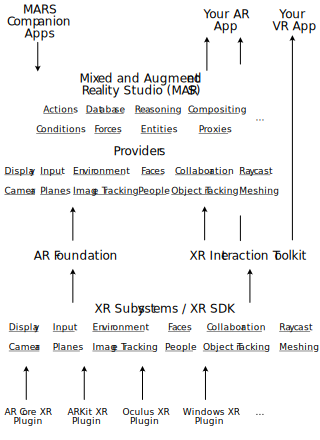

## <a href="../">!=</a>ar simulation
> Build AR apps with confidence.  
Iterate fast, right in Editor.  
Non-invasive, drop-in solution.  

#### What is this?
ARSimulation is a custom XR backend built on top of the [XR plugin architecture](https://blogs.unity3d.com/2020/01/24/unity-xr-platform-updates/).  

It basically allows you to fly around in the Editor and test out your AR app, without having to change any code or structure. Import the package and go.

Because it's just another XR Plugin, it works with ARFoundation, XR Interaction Toolkit, and even MARS. Zero code changes or setup needed!

#### Quick Start
- Add the ARSimulation package to your project
- Press Play
- Use WASD + press RMB  to move around,  
LMB  to click/touch/interact with your app
- Done.

**Need more tracked planes?**
- drop SimulatedPlane prefab into the scene in Edit or Play Mode
- move and adjust as necessary  

[Custom Planes](https://youtu.be/I5LUYohV8oI)  
[Runtime Adjustments](https://youtu.be/eS9v0dSpYQk)

The same works for Point Clouds!
(Tracked 3D Objects Coming Soon™)

**Have a more complicated setup to test?**
- add your geometry into a separate scene
- add the scene to XY
- press Play
- Done.

[Complex Environment Simulation](https://youtu.be/nPvPdRppIpY)

See the Sample <<>> for a nicely dressed apartement as starting point.

##### Recommended packages:
- Device Simulator (but works without)
- Input System: both (but works with old/new/both)

#### Supported scenarios

#### But there is also MARS now!
> MARS: A Framework for Simplified, Flexible AR Authoring  

Unity describes MARS (Mixed and Augmented Reality Studio) as "a framework for simplified, flexible AR authoring". We were active alpha testers, trying to use it for our own AR applications, and started developing our own solution in parallel. After a while, we stopped using MARS (besides of course testing and giving feedback to new releases).  

MARS is very ambitious and future-facing. It tries to anticipate many new types of devices and sensors, and to do that, reinvents the wheel (namely: ARFoundation) in many places.  
It wraps _around_ ARFoundation instead of extending it, which is great for some usecases but makes it very heavy for others.  
A core concept of MARS is _Functionality Injection_, which at its base feels pretty similar to what the XR SDK system is trying to achieve (note: FI might allow for more complex scenarious, but solves a similar problem of device-specific implementations.)

> ARSimulation: A non-invasive Editor Simulation Backend

Our goal are fast iteration times in the Editor for a range of AR applications we and partner companies build. These usually consist of placing and interacting with objects from different angles. We just needed a way to "simulate" an AR device in the Editor, not a full-blown additional framework!  

Fortunately, Unity provides the ability to build exactly that using the [XR plugin architecture]()(https://blogs.unity3d.com/2020/01/24/unity-xr-platform-updates/): a custom XR provider that works in the Editor and Desktop builds.

#### Cons of MARS
- adds 6 packages to your project
- contains everything: custom tooling, custom handles, massive settings constructs, code generators, file system watchers, a completely custom provider backend, ...
- initial setup: just adding MARS packages creates >50 new files in your project (+50 more for .meta files)
    - 5 new top-level folders in your project
    - 27 different ScriptableObjects with settings
    - 18 code-generated scripts with defines etc.
    - new tags
    - some asmdefs
    - etc.
- once you start using MARS, there isn't really a way back
- MARS wraps around ARFoundation instead of extending it. This means it's not really feasible to use it for existing projects, unless you plan on converting a bunch of things to new components and 

#### Known Issues
- camera background is supported (with custom 3D scenes), but no occlusion support right now
- environment cubemap support is platform-specific (Unity bug)
- no support for simulating faces, people, or collaboration right now
- partial support for meshing simulation (some support, but not quite identical to specific devices)

#### Open Issues on Unity's end
Unfortunately it seems nobody at Unity anticipated someone building custom XR providers in C# that are actually supposed to work in the Editor. It's advertised as a "way to build custom C++ plugins" only.  

This has lead to funny situations where we reporting bugs around usage in Editor (e.g. of the ARFoundation Samples, XR Interaction Toolkit, and others), and Unity telling us that these "don't matter since you can't use them in Editor anyways". Well guys, we hope now you see why we were asking.  

**Here's a rough overview of Known Issues:**  
- Device Simulator has no way to do multitouch simulation (usually a must for any touch simulator). This means that rotating in ARFoundation isn't working out of the box in Editor right now. We are currently using LeanTouch as a workaround, as that gives proper multitouch simulation support in both Game View and Device Simulator.
- There's a number of warnings around subsystem usage in Editor. They seem to not matter much but are annoying (and incorrect).
- There's an open issue with Cubemap creation in Editor (necessary for Environment Probe simulation): https://issuetracker.unity3d.com/product/unity/issues/guid/1215635
- 